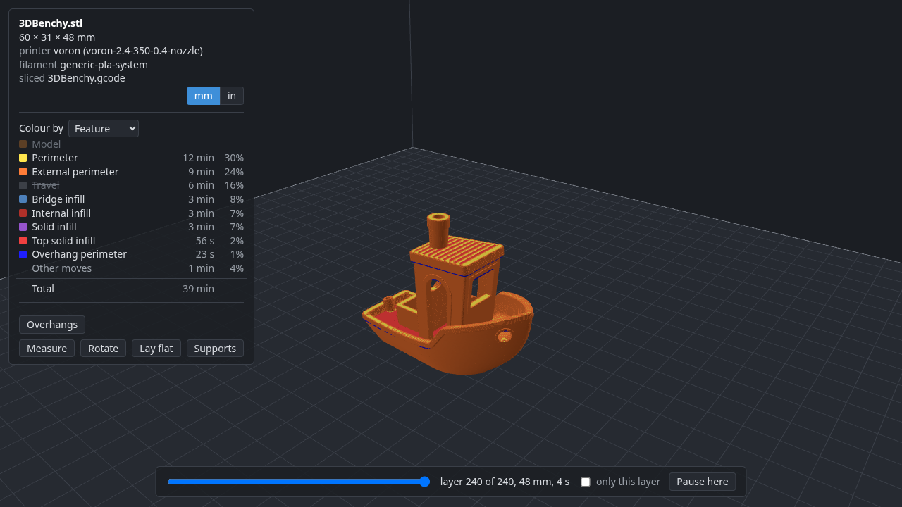

# deli-slicer

A CLI-first slicer front end for 3D printing.

`deli` keeps a print job as a plain-text `deli.toml` in the current directory. Each
subcommand edits that file and exits, so a print is set up with a few commands in a
shell and a file you can read, with nothing else to open. Slicing
is done in-process by PrusaSlicer's `libslic3r`, so no slicer application needs to be
installed.

A folder of models is the project, and there is nothing to save: every command
updates `deli.toml` as it goes. Come back months later, `cd` into the folder, and
`deli send --print` prints the same parts, placed the same way, with the same profiles
and settings.


```
deli setup                # once: tab completion, your printer, and how to reach it
deli add 3DBenchy.stl
deli slice                # how long it will take, and how much filament
deli view                 # the sliced Benchy in your browser, layer by layer
deli send --print         # to the printer, and start it
```

Status: early. Everything above works; deli converts and slices for most of the
printers OrcaSlicer knows, but has printed on only one so far. See "Not done yet" at the
end.

## Motivation

deli came out of my frustrations with the slicers I was using:

- **PrusaSlicer has no settings built in for my printer**, an Elegoo Centauri Carbon.
- **OrcaSlicer does, but it crashes often** and generally does not like my PC.
- **OrcaSlicer supports lots of printers, but it is somewhat focused on Bambu Lab's.**
- **I have two printers, the Elegoo and a Voron, and want to configure both easily.**
  I found myself using both slicers, plus Cura now and then.
- **Both have bewildering settings screens**, mostly because there are so many settings
  and options. Most of them stay at their defaults, so finding a particular one means
  hunting and guessing, and the guess is often wrong.

So deli takes a printer's settings from OrcaSlicer, slices with PrusaSlicer's engine,
and has no window to open. Every printer is a profile in one library, chosen for each
print, so one tool can serve them all. A print is a short text file that holds only
what you changed, and you change a setting by its name: `deli set infill 20%`. When
the name is not quite right, deli suggests the ones that are close.

The longer story, with clips of each part, is in the blog post
[deli: A 3D Printer Slicer That Lives in My Shell](https://hullabalooing.cruver.ai/side-projects/posts/deli-a-3d-printer-slicer-that-lives-in-my-shell/).

## Install

deli is a Python package with PrusaSlicer's slicing engine compiled in. On Linux
(and Windows, in WSL: see below) or macOS, in one line:

```
curl -LsSf https://raw.githubusercontent.com/dcruver/deli-slicer/main/install.sh | sh
```

[The script](install.sh) installs the latest release's wheel for your machine with
[`uv`](https://docs.astral.sh/uv/), installing uv first if you don't have it; uv
fetches Python 3.12 if you don't have that either. Run it again to upgrade, or with
`DELI_VERSION=0.4.2` in front of `sh` for a particular release. Then run `deli setup`.

### From a release, by hand

You need Python 3.12 or newer and `uv` (or `pipx`).

Each [release](https://github.com/dcruver/deli-slicer/releases) has a wheel for each
platform with the engine inside; nothing else needs building. Install the one for your
machine (for 0.10.0):

```
# Linux, x86-64 (most PCs)
uv tool install https://github.com/dcruver/deli-slicer/releases/download/v0.10.0/deli-0.10.0-cp312-abi3-manylinux_2_28_x86_64.whl
# Linux, ARM64 (Raspberry Pi 4/5 on a 64-bit OS, ARM servers)
uv tool install https://github.com/dcruver/deli-slicer/releases/download/v0.10.0/deli-0.10.0-cp312-abi3-manylinux_2_28_aarch64.whl
# macOS, Apple Silicon (M1 and later)
uv tool install https://github.com/dcruver/deli-slicer/releases/download/v0.10.0/deli-0.10.0-cp312-abi3-macosx_11_0_arm64.whl
# macOS, Intel
uv tool install https://github.com/dcruver/deli-slicer/releases/download/v0.10.0/deli-0.10.0-cp312-abi3-macosx_10_15_x86_64.whl
```

(`pipx install` takes the same URLs.) That puts `deli` on your PATH. The Linux wheels
need glibc 2.28 or newer, which most distributions from 2019 on have: Debian 10,
Ubuntu 18.10, RHEL/Alma/Rocky 8, Fedora 29 and later. The macOS wheels need macOS 11
(Apple Silicon) or 10.15 (Intel). All of them need Python 3.12 or newer.

### On Windows, in WSL

There is no Windows wheel; on Windows, deli runs in
[WSL](https://learn.microsoft.com/windows/wsl/install), Windows' own Linux, with the
Linux x86-64 wheel. In PowerShell, once:

```
wsl --install
```

Then, in the Ubuntu terminal it opens:

```
curl -LsSf https://raw.githubusercontent.com/dcruver/deli-slicer/main/install.sh | sh
```

It should work as on Linux (see below for how far that has been checked), with a few
things to know:

- **Your printer:** give `deli setup` its IP address, or a name your router knows. Names
  ending in `.local` often don't resolve inside WSL. On Windows 11, WSL's
  [mirrored networking](https://learn.microsoft.com/windows/wsl/networking#mirrored-mode-networking)
  (`networkingMode=mirrored` in `.wslconfig`) puts WSL on your network like any other program.
- **`deli view`:** open the address it prints in your Windows browser.
- **Your models:** Windows' folders are under `/mnt/c/`, so `C:\Users\you\Downloads` is
  `/mnt/c/Users/you/Downloads`. Reading from there is slower than from WSL's own folders,
  but fine for a few models.

**How far this has been checked:** nobody has used deli on a Windows PC yet. What is
checked is automatic: for each release, a GitHub Actions job on one of GitHub's Windows
Server machines sets up WSL 2 with Ubuntu 24.04, installs the wheel with `uv` (not
with the one-line script), and runs deli's test suite, which slices but talks only to fake printers. `deli setup`
and `deli send` with a real printer, `deli view` in a Windows browser, the networking
notes above and models under `/mnt/c/` are untested; they come from how WSL works, not
from trying them. If you run deli on Windows, an issue saying how it went would help.

Then let deli set itself up:

```
deli setup
```

It sets up tab completion for your shell, then asks for your printer's hostname or IP
address and asks the printer what it is: a Klipper printer says its nozzle, bed and
height, and setup lists OrcaSlicer's printers that fit; an Elegoo printer says its model,
and setup asks only the nozzle size. The printer is imported with Orca's process and
filament for it, fitted to what it reported (no taller prints than its Z travel, the
material passed to a `PRINT_START` that reads it), and its address kept for `deli send`.
A printer deli cannot reach is found by any part of its name instead. A Bambu Lab
printer is recognised, but deli cannot send to one yet. Run it again to add or change a printer. Everything it does can also be done step by
step, as the next sections show.

### From source

The first build compiles PrusaSlicer's dependencies (about 35 minutes) and then the
engine (about 15), and needs CMake, Ninja, a C++17 compiler and about 5 GB of disk.
`PLAN.md` has the details under "Dependency build"; the short version:

```
git clone https://github.com/dcruver/deli-slicer.git && cd deli-slicer
git submodule update --init --depth 1
ci/build-deps.sh     # PrusaSlicer's dependencies, into build/deps
make install
```

`make install` installs `deli` as a `uv` tool pointing at the checkout, so `git pull`
updates it; after a change to the C++ binding, `make reinstall`. `make wheel` builds
a wheel in `dist/` to give to someone else.

### Shell completion

Completion covers commands, options, printers, filaments and processes (yours and
OrcaSlicer's), the parts of the current print, setting names and their short names, and
config keys. `deli setup` sets it up; by hand, it is one of:

```
eval "$(deli completion bash)"      # in ~/.bashrc
eval "$(deli completion zsh)"       # in ~/.zshrc
deli completion fish > ~/.config/fish/completions/deli.fish
```

`deli setup` puts bash's in `~/.local/share/bash-completion/completions/` when the
bash-completion package is installed, which loads it with nothing in `~/.bashrc`, and
adds the line to `~/.zshrc` only if you say yes.

## Set up a printer

To slice, deli needs three things for your printer: the **printer** itself (bed size,
nozzle, start and end G-code), a **process** (layer height, speeds, infill: what
PrusaSlicer calls print settings) and a **filament**. You don't write any of them.
deli converts them from [OrcaSlicer](https://github.com/SoftFever/OrcaSlicer)'s
presets, which cover over a thousand printers, and choosing your printer gets all
three. You don't need OrcaSlicer installed. `deli setup` does the steps below for you;
this is what it does, and how to do more.

### 1. Find your printer

```
deli vendor                      # the vendors, with how many printers each
deli vendor Voron                # one vendor's printers
deli vendor "voron 2.4"          # or any part of a name: the printers that match
```

Orca's printer names end with the nozzle size, such as `Voron 2.4 350 0.4 nozzle`. Pick the one with the nozzle your printer has; most printers ship with 0.4 mm.
Vendor names are Orca's folder names, so Bambu Lab's printers are under `BBL`; the
list shows what a vendor's printers are called when it differs.

### 2. Choose it

```
deli printer "Voron 2.4 350 0.4 nozzle"
```

Any part of the name that is enough to tell it apart will do (`"voron 2.4 350 0.4"`),
in any case. A printer that is not in your library yet is imported from Orca as it is
chosen, with the process and filament OrcaSlicer starts it with, and all three become
the defaults for new prints:

```
Imported printer 'voron-2.4-350-0.4-nozzle' from Orca 2.4.2's 'Voron 2.4 350 0.4 nozzle' (51 settings, 7 left out)
Imported process '0.20mm-standard-voron', Orca's default for this printer (93 settings, 16 left out)
  and made it the default process for new prints on 'voron-2.4-350-0.4-nozzle'
Imported filament 'generic-pla-system', Orca's default for this printer (27 settings, 20 left out)
  and made it the default filament for new prints on 'voron-2.4-350-0.4-nozzle'
Made 'voron-2.4-350-0.4-nozzle' your default printer for new prints
Printer set to 'voron-2.4-350-0.4-nozzle'
  bed 350 x 350 mm, height 325 mm, nozzle 0.4 mm, firmware klipper
  Filament set to 'generic-pla-system', from your config for this printer
  Process set to '0.20mm-standard-voron', from your config for this printer
```

You can slice now. The settings "left out" are ones PrusaSlicer's engine has no
equivalent for; they need nothing from you. [PRINTERS.md](PRINTERS.md) says which of
Orca's printers deli has converted and sliced with, and why the rest fail. Slicing is
not the same as printing well; see "Not done yet" for what has actually been printed.

Defaults are only filled in where you have none, so a second printer does not change
your default printer, and a filament you chose yourself stays chosen. Once imported, a
printer is in your library (`~/.config/deli/`), and choosing it again reads it from
there: a newer deli or a newer Orca never changes a printer under you.

### 3. Other filaments and processes

```
deli filament                              # the filaments for your printer, the one in use marked
deli filament "Generic PETG @System"       # choose one
deli process                               # the processes for your printer
deli process "0.15mm optimal"              # choose one
```

`deli filament` lists the filaments made for the print's printer (or your default one),
with any you have used or loaded yourself, and marks the one in use and the default.
`deli process` does the same for processes, and `deli printer` lists your printer's
vendor's printers. It makes no difference whether one has been used before: choose any
of them by name, or a part of it, and deli fetches and converts it as needed, for your
printer. Orca's Generic filaments (`Generic PETG @System` and so on) fit any printer; the
list counts them. `--default` makes a choice what new prints start with instead of
choosing it for this one.

### `deli import`: more control

`deli import orca printer|process|filament "<name>"` converts one of Orca's presets
without choosing it, and says more about the conversion: the notes on what
deli did, and with `-v` every Orca setting left out. Run it again to replace a profile
with a fresh conversion, after a deli upgrade that fixes the converter, say.
`--printer "<name>"` converts a process or filament for another printer than the one it
says it fits, `--printer-only` imports a printer without its defaults, `--name` stores
it under another name and `-o FILE` writes the INI file instead.

### Where the presets come from

deli reads Orca's presets from its GitHub repository at release 2.4.2, the release
[PRINTERS.md](PRINTERS.md) was made from. A release never changes, so what is fetched
is kept in `~/.cache/deli/orca/` and read from there afterwards. Other sources:

- `deli import ... --ref main` (or any tag) reads another version of Orca's presets,
  for printers newer than the release. Only releases are kept; `main` is fetched each
  time.
- `deli import ... --local` reads the OrcaSlicer installed on this machine instead,
  **including presets you have edited or created in Orca**, which only exist there.
  `--orca DIR` adds a folder of Orca presets.

Listing every vendor makes one call to GitHub's API, which allows 60 an hour without
signing in, and is then kept like the rest.

### Without OrcaSlicer's presets

`deli load` takes a PrusaSlicer INI file from a path, a `file://` URL or an `https://`
URL, including a link to a file's page on GitHub:

```
deli load printer  ~/Downloads/my-printer.ini --name my-printer   # a PrusaSlicer export, say
deli load filament https://example.com/profiles/my-petg.ini        # or a file someone hosts
deli printer my-printer                                            # then choose it as usual
```

Without `--name`, a profile is named as the file names it (PrusaSlicer's
`printer_settings_id` and the like), and `deli load` says what that is.

A full PrusaSlicer export holds a printer, a process and a filament; `deli load printer`
keeps only the printer's settings, so load it once for each. This repository's
`profiles/` has a few to try, converted from Orca's and checked to slice.

Anyone can host a printer this way: a PrusaSlicer INI file at any `https://` address.
Imported or loaded, a file never carries a printer's network address or API key; those
go in your config (below).

### Tell deli where your printer is

To send prints to it, deli needs its address:

```
deli config printers.voron-2.4-350-0.4-nozzle.host moonraker://voron.local
```

And to change what new prints start with:

```
deli printer voron-2.4-350-0.4-nozzle --default   # the printer new prints start with
deli filament "Generic PETG @System" --default     # the filament new prints on it start with
deli process "0.15mm Optimal @Voron" --default     # its usual process
```

This writes `~/.config/deli/config.toml`, which you can also edit by hand. `host` is
where `deli send` sends; its scheme says what kind of host the printer is:
`moonraker://` (Klipper), `octoprint://` or `elegoo://` (Elegoo's Centauri Carbon)
(`api_key` alongside, if the host needs one). `filament` and `process` are what a new
print on that printer starts with, so you do not choose them again for every print.
They are defaults and nothing more: a print that chooses another filament is sliced
and sent like any other.

The three `--default` lines write the config's `printer` key (`deli config printer
<name>` sets the same one), and that printer's `filament` and `process` (the keys
`deli config printers.<printer>.filament` and `.process` set). A print started in a
new directory, with `deli add` say, takes all three, written into its `deli.toml` like
any other choice. A print that wants something else chooses it with `deli printer`,
`deli filament` or `deli process` as usual, and changing a default later leaves the
prints you already have alone. `deli printer` marks your default in its list, and
`deli config` shows everything that is set.

## Print something

In a new directory:

```
deli add 3DBenchy.stl                 # STL, OBJ, 3MF or AMF; the print starts with your default printer, filament and process
deli printer "bambu p1s 0.4"          # another printer for this print, by any words of its name; its filament and process come with it
deli filament "generic petg"          # another filament than its default, converted for this printer
deli set infill 20%                   # or any PrusaSlicer setting by name
deli supports organic                 # automatic supports, for a model that needs them: on, off, grid, snug, organic
deli scale 150%                       # a bigger boat
deli scale z 60mm                     # or one side to a size, the others left as they are
deli rotate 45                        # turned on the bed
deli move 60 80                       # put it there instead of in the middle
deli pause 40                         # pause once layer 40 is done: change the filament for a two-colour boat
deli view                             # the Benchy on the bed in your browser, live; the shell stays free
deli slice                            # how long it takes and how much filament; the view then shows it layer by layer
deli send                             # uploads it, slicing first if needed; add --print to start printing
```

`deli set` with nothing after it lists the settings this print changes, each with what
its profile had, so the few things you changed are never lost among the hundreds you
didn't. Settings that come from the printer, filament or process are not in that list;
to look one up, give its name, and deli says where its value comes from:

```
$ deli set
fill_density = 20%  (the process '0.30mm-standard-elegoo-cc-0.6-nozzle' has 15%)
layer_height = 0.25  (the process '0.30mm-standard-elegoo-cc-0.6-nozzle' has 0.3)
$ deli set temperature
temperature is not changed by this print; the filament 'elegoo-pla-ecc' has 210
$ deli set fuzzy_skin
fuzzy_skin is not changed by this print; PrusaSlicer's default has none
```

`deli unset layer_height` goes back to the profile's value. Several settings go in one
command, `deli set infill 20% walls 3`, and `deli unset` alone lists what there is to
remove. When you know roughly what a setting is called, give that: `deli set temp`
lists every setting with `temp` in its name, each with its value and where it comes from.

A value can come from a file, `@` in front of its name, which is how to give G-code:

```
deli set --printer voron-2.4-350-0.4-nozzle start_gcode @start.gcode
deli set start_gcode                                    # shows it as lines
```

deli keeps the text, not the file's name, written as lines in `deli.toml` or your config,
so it reads and edits like G-code there:

```toml
[printers."voron-2.4-350-0.4-nozzle".settings]
start_gcode = '''
M190 S{first_layer_bed_temperature[initial_extruder]}
M109 S[first_layer_temperature]
PRINT_START EXTRUDER=[first_layer_temperature] BED={first_layer_bed_temperature[initial_extruder]} MATERIAL=[filament_type]
'''
```

On the command line a line break is `\n`, as PrusaSlicer writes it. A filament's start and
end G-code are one value per extruder in PrusaSlicer, `;` between them; a value you give is
one extruder's, comments and all, and several extruders' are written quoted as PrusaSlicer
does (`"..." ; "..."`).

A setting you want on every print, whichever printer, goes in your config instead of
the print, with `--global`:

```
deli set --global infill 20%          # for every print, in ~/.config/deli/config.toml
deli set --global                     # list those
deli unset --global infill            # back to each print's profile
```

It lies under every print's own settings, which still win, so `deli set infill 30%` in
one directory changes that print alone, and the listing says which is which. A global
setting changes a print's G-code like any other change: `deli send` slices again first.

A printer that is not quite Orca's any more, after upgrades and modifications, keeps its
differences the same way, under its name; so does a spool that prints best a little off
its profile, or a process you always adjust:

```
deli set --printer voron-2.4-350-0.4-nozzle max_print_height 310
deli set --printer voron-2.4-350-0.4-nozzle start_gcode "..."
deli set --filament generic-pla-system temperature 215
deli set --process "0.20mm Standard @Voron" walls 3
deli set --printer voron-2.4-350-0.4-nozzle       # list a profile's
```

They go in your config beside Orca's profile, not into it, so every print with that
profile has them, and a `deli import` of a newer Orca profile keeps them. This is deli's
custom profile: Orca's base plus your changes. The layers, each winning over the one
before: the chosen profiles; your global settings; the printer's; the filament's; the
process's; the print's own. A name can be any part of it that only one profile in your
library has.

A print can hold several models, each added the same way, and copies of one:
`deli add 3DBenchy.stl --count 4` prints four, arranged on the bed for you. With more
than one model, `scale`, `rotate` and `move` take the model's name first
(`deli scale 3DBenchy 150%`).

The G-code is kept in deli's cache (`~/.cache/deli/gcode/`), not beside `deli.toml`:
`deli send` and `deli view` find it there, and `deli send` slices again by itself when
the print has changed since. `deli slice -o FILE` (or `-o DIR`, `-o .` for here) also
writes a copy where you want it, to put on an SD card or open in another program.

Supports are PrusaSlicer's automatic ones. `deli supports on` uses the style the
process came with (Orca's tuning for the printer carries over); `organic`, `snug` or `grid` pick one and turn them on; `--angle 45` supports
overhangs steeper than that, and `--buildplate-only` keeps them off the part itself.
`deli supports` alone says what is in force and where it comes from. Underneath these
are ordinary settings (`support_material`, `support_material_style`, ...), so
`deli set` shows them and `deli unset supports` turns them off.

Parts are arranged on the bed for you, a single part in the middle. `deli move 60 80`
puts the middle of a part at x 60, y 80 instead, in millimetres from the bed's origin
(the axes `deli view` draws). The first time something on a plate is moved, everything
else on that plate keeps where it is, given a place of its own (`deli move` says so), so
that moving one thing never moves another; moved parts and copies that would overlap are
refused.
`deli move z -0.25` sinks a part a quarter of a millimetre into the bed, which is what
a part resting on an edge or a lip needs to get a first layer; what is below the bed
is not printed. `deli move auto` gives the placing back, and `deli translate` is the
same command under another name. A part with copies is moved a copy at a time:
`deli move box --copy 2 60 80` places the second, and `deli rotate box --copy 2 x 90`
turns it alone (rotating the part turns every copy). `deli arrange` has every part and
copy arranged again, as before any was moved; `deli arrange --plate 2` only what was
moved on plate 2, which stays there.

What does not fit on the bed goes on a second plate, and so on, as many as it takes, and
`deli slice` writes a G-code file for each (`stand-plate1.gcode`, `stand-plate2.gcode`)
and says what is on each and how long it takes. `deli move box plate 2` keeps a part to
plate 2, its place (`deli move box 60 80`) then on that plate, and `deli move box
--copy 3 plate 2` keeps only the third copy there; `deli move box auto` lets it go on
the first plate it fits on again. A print that fits on one plate never
mentions plates. `deli send` uploads every plate; `deli send --plate 2 --print` uploads
plate 2 and starts it, since a printer prints one plate at a time.

`deli pause 30` has the printer pause once layer 30 is done, to drop in a magnet or a
nut, or to change the filament: deli has no separate colour-change command, because a
pause is where you change it. What is written is the printer's own pause G-code (on
many printers `M600`, the filament-change command itself; `deli set pause_print_gcode`
changes it). Layers are counted as the slider in `deli view` counts
them, so slide to the last layer you want printed before the pause and use that
number. `deli slice` reports each pause with its height, and refuses a pause after a
layer the print does not have. On a print with several plates, `deli pause 30 --plate 2`
pauses plate 2; without `--plate` a pause is the first plate's.

`deli view` opens a page in your browser and gives the shell straight back; the page
follows the print as you change it. It shows the parts on the bed and, once `deli slice`
has run and for as long as the G-code is still the print's, every extrusion in it,
supports included, coloured by what it is for. The parts are then drawn faint over the
extrusions, or hidden: Model in the legend shows or hides them, and they come up by
themselves for the tools that need them. When the print has changed since it was
sliced, or has never been, the page shows the parts and says so, with a Slice button
that runs `deli slice` and shows what it printed. Sending stays in the shell. A print
with several plates has a button for each, and the page shows one plate at a time.

The slider at the bottom goes through the layers, each with the time it takes, cutting
the parts at the same height; a box shows only that layer. With no G-code it cuts the
parts at a height instead, to show their inside. The colours turn lighter where the
print pauses. The legend says how long each kind of extrusion takes, and travel; click
one to hide or show it. "Colour by" colours the print by speed, flow (mm³/s) or layer
time instead, from blue for the least to red for the most, which shows at a glance what
is slow. The times are PrusaSlicer's estimate from reading the G-code back, as its own
G-code viewer makes it, and can be a minute or two from the one `deli slice` reports.
Overhangs shows in red the faces supports would hold up (at the print's
`support_material_threshold`, or the angle PrusaSlicer works out when it is 0).

Dragging, Rotate and Lay flat change the print with deli's own commands: drag a part over
the bed for its `deli move` (a copy is moved by itself, with `--copy`; a drag that would put
it off the bed or on another part offers nothing); with Rotate (or R) drag a part around to
turn it on the bed, by 15°, or 1° with Shift, for its `deli rotate ... z` (and, for one not
yet placed, the `deli move` that keeps it where it is); or with Lay flat click a face of one
for the `deli rotate` that lays that face on the bed (that copy's only); Arrange, once something has been
moved, gives `deli arrange` (`--plate N` for the plate shown, on a print of several); Pause here, beside the layer slider, does the same for `deli pause` at that
layer. The page shows the command, and Apply runs it (Copy, to run it yourself); either
way `deli.toml` changes as the command says and the page follows. Once the print is
sliced, and deli knows the printer's address, Send and Print run `deli send` for the
plate shown (Print, which starts the printer, asks once more). Only the page at the
address `deli view` printed can apply commands. To measure, press Measure (or M) and
click two points on the parts or the print: the line follows the pointer from the first,
and the page shows the distance between them and along each axis, snapping to a corner
of a part when you click near one. Esc clears; a right-click clears and puts the tool
down. The mm / in switch, below the print's description, shows every length on the page (sizes,
places, layer heights, measurements) in millimetres or inches; commands stay in
millimetres. Supports, beside the tools, gives `deli supports on` or `off`.

The page is served in the background until it has been closed for ten
minutes, or until `deli view --stop`. When the printer's profile asks for a thumbnail,
`deli slice` draws one into the G-code for the printer's screen.



`deli printer`, `deli filament`, `deli process`, `deli set`, `deli supports`,
`deli scale`, `deli rotate`, `deli move` and `deli pause` without arguments show what
is chosen. `deli remove`, `deli unset`, `deli scale 100%`, `deli rotate 0`,
`deli move auto`, `deli arrange` and `deli pause off` undo things. Everything is in `deli.toml`, which
is plain TOML you can edit, comment and commit:

```toml
pause = [40]

[printer]
name = "voron-2.4-350-0.4-nozzle"
sha256 = "9510435c7c2100a23514b823aaab26fc37e9efe6a7e8031c1a2e03ecb687192c"

[[part]]
file = "3DBenchy.stl"
scale = [1.5, 1.5, 1.5]
rotate = [0, 0, 45]
at = [60, 80]

[settings]
fill_density = "20%"
support_material = 1
support_material_auto = 1
support_material_style = "organic"
```

The filament and the process have tables like the printer's. The hash records which
version of the printer the print was set up with; if the printer in your library
changes, `deli slice` says so and `deli printer <name>` accepts the new version.

Before a first real print: `deli send` without `--print` only uploads, so you can
check the file arrived and start it from the printer's own screen.

## Commands

| | |
|---|---|
| `deli setup` | tab completion, your printer and its address, asked for once |
| `deli printer\|filament\|process [name]` | choose one for this print, by its name or any words of it, from your library or else OrcaSlicer's (imported as it is chosen, under Orca's name or `--name NAME`; a printer brings its default process and filament), or list your library's; `--default` makes it the default for new prints instead |
| `deli vendor [vendor\|printer]` | list printer vendors, a vendor's printers, or the printers a name is part of |
| `deli import orca <kind> "<name>"` | convert an OrcaSlicer preset into your library without choosing it |
| `deli load <kind> <source>` | copy a PrusaSlicer INI file into your library |
| `deli add <file> [--count N]` | add a model, or more copies of it |
| `deli remove <part> [--count N]` | take a part, or some copies, out |
| `deli set [setting] [value]` / `deli unset` | change, show or list this print's settings; `--global`, `--printer NAME`, `--filament NAME` or `--process NAME` for every print's with that profile, in your config; `@FILE` reads a value, G-code say, from a file |
| `deli supports [on\|off\|organic\|snug\|grid]` | automatic supports, `--angle`, `--buildplate-only` |
| `deli scale [part] [x\|y\|z] <factor>` | `110%`, `1.1`, or `30mm` with an axis |
| `deli rotate [part] [x\|y\|z] <degrees>` | about z when no axis is given |
| `deli move [part] [--copy N] <x> <y>` | where the part's middle goes on the bed, or one copy's; `z -0.25` sinks it, `plate 2` keeps it to plate 2, `auto` has it arranged again. `deli translate` is the same command |
| `deli arrange [--plate N]` | arrange every part and copy again, or one plate's, forgetting where they were moved |
| `deli pause [off] [layer ...] [--plate N]` | pause after a layer, counted as the slider in `deli view` counts them; also how to change filament mid-print |
| `deli slice [-o FILE\|DIR]` | slice, and say how long it takes and how much filament; `-o` writes a copy of the G-code. Parts that do not fit go on further plates, a file each |
| `deli view [--stop]` | the parts on the bed in your browser; after `deli slice`, the sliced print with its supports, layer by layer. Served in the background until the page has been closed for ten minutes, or `--stop` |
| `deli send [FILE] [--print] [--plate N]` | upload to the printer in your config, slicing first if the print has changed; every plate, or `--plate N` |
| `deli config [key] [value]` | your default printer, your printers' addresses and default filament and process, and the settings for every print and for each profile |
| `deli completion bash\|zsh\|fish` | shell completion |

`deli <command> --help` has the details.

## Not done yet

Things that a user would notice, roughly in the order they matter:

- **One printer has printed deli's G-code so far**: an Elegoo Centauri Carbon, with
  its profile converted from Orca's and the files sent with `deli send --print`. A cube
  in PLA printed well; a Benchy in PETG-CF stopped at its `deli pause`, parked the head,
  carried on when resumed and ran to the end, but came out stringy, from a spool that
  was probably damp. Nothing with supports has been printed, and `deli send` to
  Moonraker and OctoPrint hosts has only been tested against fakes. If you print with
  another printer, please say how it went (see [CONTRIBUTING.md](CONTRIBUTING.md)).
- **Converted profiles differ from Orca in small ways.** The first layer's layer-change
  G-code is skipped; one bridge speed instead of two; no brim where Orca would add one
  automatically. `PLAN.md` has the full list with measurements.
- **What printers' screens show is barely checked.** The G-code carries the `M73`
  remaining-time lines and, for converted printers, the comment lines Orca's files end
  with (the profile's `gcode_footer`), where some firmware reads the layer count. The
  Centauri Carbon shows the layer count; its remaining time has not been watched yet.
- **Other printers.** Of the 1,001 printers OrcaSlicer 2.4.2 ships, 789 convert and slice a
  test cube; [PRINTERS.md](PRINTERS.md) lists every one, and why the rest fail. Only
  the Centauri Carbon and the Bambu Lab P1S have been compared with Orca's own output.
- **Bambu printers can't be sent to.** `deli send` does not speak Bambu's LAN or cloud
  protocols; write the G-code out with `deli slice -o .` and copy it over by hand (SD
  card, or another program's send).
- **No Windows wheel.** On Windows, deli runs in WSL ([above](#on-windows-in-wsl)); a
  wheel of its own needs `deli view`'s background server ported first.
- **Settings apply to the whole print**, not to one part.
- **Supports** are PrusaSlicer's automatic ones; painted supports need a 3MF painted
  elsewhere, which is untested.
- **One filament per print.** A change by hand at a `deli pause` is the only kind;
  filament-change G-code for multi-material printers is not converted.
- **No STEP files.** PrusaSlicer reads them through a library deli does not ship.
- **Hosts:** PrusaLink, Duet and the others PrusaSlicer knows are not supported by
  `deli send`; the Centauri Carbon 2's newer protocol is not either.

## Engine

PrusaSlicer 2.9.6's source is vendored as a git submodule at `vendor/PrusaSlicer`.
deli links its `libslic3r` into a Python extension module; nothing of PrusaSlicer's
GUI is built. `PLAN.md` has the build details and the project's current state.

## Contributing

[DESIGN.md](DESIGN.md) says how deli is meant to work and why; [CONTRIBUTING.md](CONTRIBUTING.md)
says how to build it, test it and send a change, and what help is most wanted (printing
with a printer that has not printed deli's G-code yet, above all). [CHANGELOG.md](CHANGELOG.md)
lists what changed in each release.

## License

AGPL-3.0-only, the same licence as the PrusaSlicer code it links. See [LICENSE](LICENSE).
The profiles in `profiles/` are derived from OrcaSlicer's, which are AGPL-3.0 too. The
libraries compiled into deli's wheels, and the three.js the viewer bundles, are listed
with their licences in [THIRD-PARTY-NOTICES.md](THIRD-PARTY-NOTICES.md).
